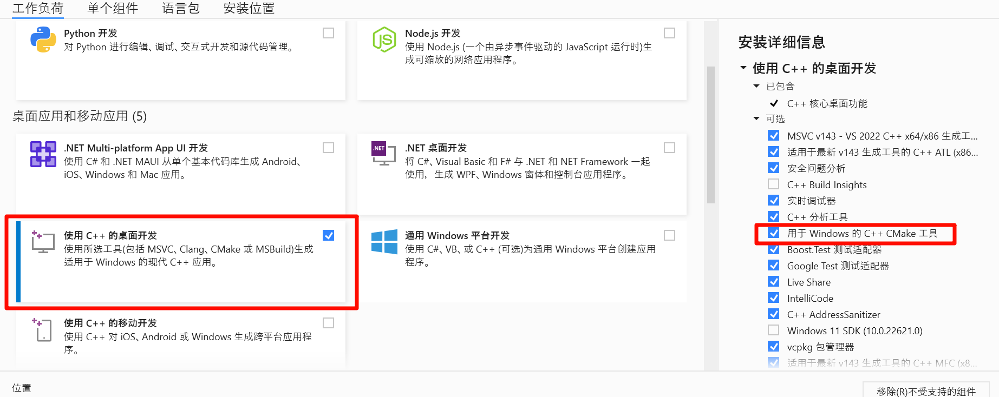

# 如何配合 IDE 使用 CMake

CMake 作为一个广泛使用的构建工具，被各种 IDE 非常好地支持，在 IDE 中直接使用并不是难事。这样，你就可以利用 IDE 已经提供好的各种工具，例如调试器（debugger）等，进行除了生成程序外的功能。当 CMakeLists 更新时，IDE 会自动进行合适的调整来构建目标。

> 事实上 IDE 可以自动安装一个 CMake，不过为了简化说明，我们在前面的章节中统一要求你单独安装了 CMake，从而不论什么情况你都可以在命令行以及 VSCode 中使用 CMake。如果你只想利用 IDE 本身的 CMake，请自行进行设置。

## Visual Studio

请在[Visual Studio 官网](https://visualstudio.microsoft.com/)下载 VS 社区版，在安装时勾选“**使用 C++ 的桌面开发**”，并且确保右边的“**用于 Windows 的 C++ CMake 工具**”已被勾选。

如果你已经下载了，可以随时在 Visual Studio Installer 中进行更新（在下面任务栏中搜索即可）。

> 如果 VS 的更新非常慢，与正常网速严重不匹配，可以在[download.visualstudio.microsoft.com - dns 查询--站长工具 (chinaz.com)](https://tool.chinaz.com/dns/download.visualstudio.microsoft.com)中找到 TTL 值最小的 IP 地址，并在`C:\Windows\System32\drivers\etc`中的`hosts`文件（请用管理员模式打开）的最后一行加上`在网站中找到的地址 download.visualstudio.microsoft.com`即可。

### 已有 CMakeLists

点击 VS，点击“打开本地文件夹”，打开含有 CMakeLists.txt 的文件夹即可。

### 创建 CMake 工程

你也可以像创建空项目一样，用 Visual Studio 创建一个 CMake 工程：

点击“CMake 项目”即可，VS 已经生成了一个较为复杂的 CMake 模板，暂时只需要改动或增加`add_executable`的部分即可。

## CLion

### 已有 CMakeLists

点击 Open，打开含有 CMakeLists.txt 的文件夹即可。

### 创建 CMake 工程

CLion 默认使用的管理工具就是 CMake，所以点击“New Project”，把语言标准调整为`C++20`即可。

## VSCode

VSCode 本身只是编辑器，因此建议安装 Microsoft C/C++ 来提供基本的 C/C++ 代码补全及相关功能，并安装 CMake 和 CMake Tools 两个插件以获得 CMake 的良好支持。注意把 CMake Tools 插件中的设置中的“status bar visibility"改为"compact"，如下：

这时下方的状态栏就会出现 CMake 相关的图标，点击"Kit"的选项选择工具链；如果你已经安装了 Visual Studio，选择`-amd64`那个即可使用`msvc`；如果你想使用 MinGW，请选择 MinGW 的那个选项。

> - 在以前的版本中，使用 VS 的 toolkit 可能需要使用管理员模式启动 VSCode 来成功构建；助教在最新版的 VSCode 和 VS2022 中未发现此问题。
> - MinGW 可能不支持非 ascii 码路径（即不支持中文路径）。

随后就可以点击齿轮进行编译，点击`▶`符号进行运行，虫子的符号进行 debug。你可以把`Debug`换为`Release`得到优化版本。如果你需要更多的可执行程序，就再加其他的`add_executable`即可。