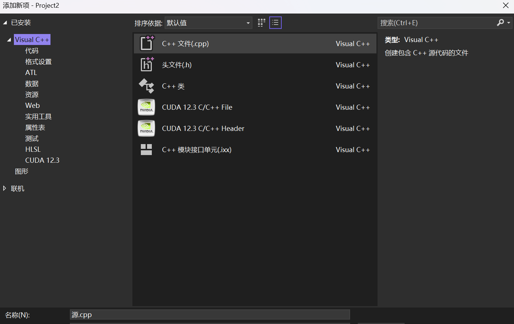
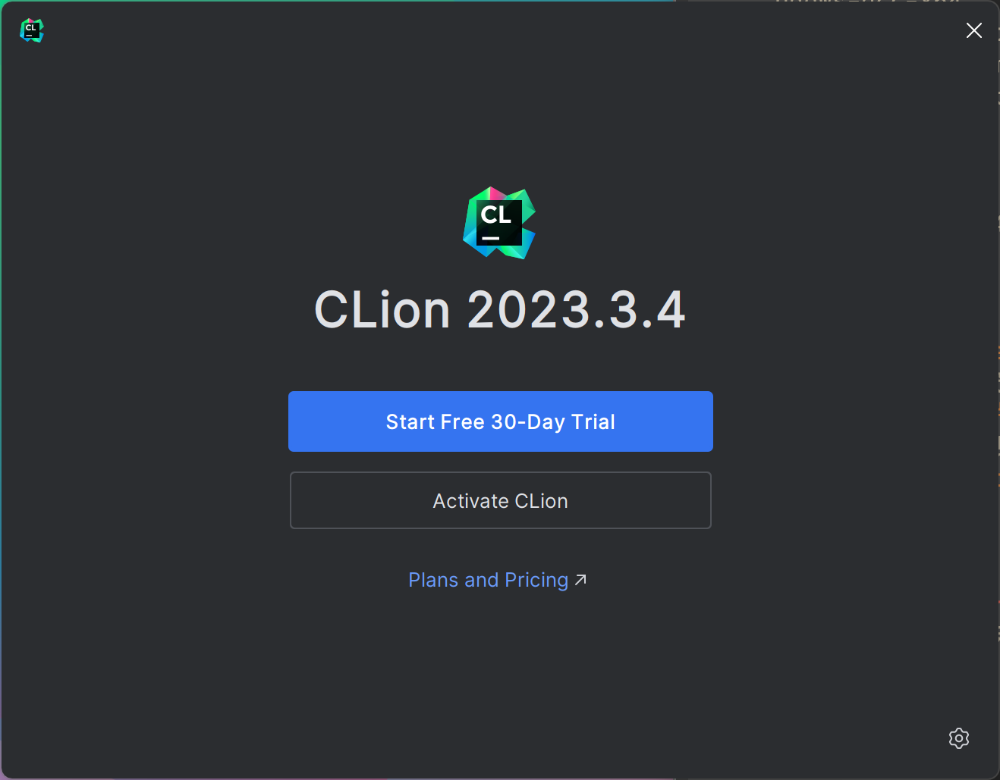
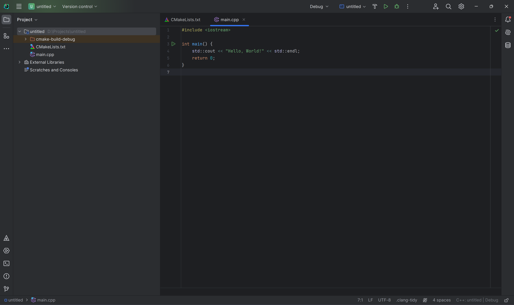

# C/C++ 开发环境配置

## 总览

程序员的开发环境一般分为以下部分：

+ **所在操作系统**：就是你的电脑当前是什么操作系统，例如Windows11，Ubuntu23.04（Linux的一种发行版）等。

+ **目标操作系统**：就是开发的程序将要在什么操作系统上运行，最简单的就是在什么操作系统上生成，就在什么操作系统上执行，在计算概论中大家就是这样的，本课程不会涉及到跨操作系统和跨平台架构的开发和编译。

+ **编译器**：能够将源代码在所在操作系统编译为目标操作系统上的可执行程序的软件。

  > 同时，为了更方便地指定哪些代码以哪些选项生成哪些可执行程序，在较大型的工程中，程序员会使用“构建工具”（Build tools）来辅助这一过程；CMake、XMake等就是这一工具。

+ **编辑器**：能够方便地把各种代码文件组织起来，提供一定的编辑功能，并允许通过**插件**进行扩展的软件。

+ **各种相关开发工具**，包括性能探测器、调试器（debugger）、格式化工具（formatter）等等。

一个IDE（Integrated development environment，集成开发环境）集合了除目标操作系统外的所有软件，并允许插件扩展，适合大型工程的开发和新手的入门。除此之外，我们也可以逐个组装，获得自己想要的环境。

## 主流编译器介绍

+ MSVC（Microsoft Visual C++）是微软提供的C和C++编译器，作为Visual Studio集成开发环境的一部分。
MSVC专为Windows平台设计，提供了丰富的库和工具，以及与Windows操作系统和其他微软技术的紧密集成。

+ GCC（GNU Compiler Collection）是一个免费、开源的编译器，支持多种编程语言，如C、C++、Objective-C、Fortran、Ada等。GCC也支持多种平台，包括Linux、macOS和Windows（通过MinGW）。

  GCC是GNU项目的核心组件，广泛应用于Unix和类Unix平台（如Linux）。

+ Clang是一个基于LLVM的轻量级、高性能的C、C++和Objective-C编译器。Clang支持多种平台，包括Linux、macOS和Windows。Clang的目标是提供更快的编译时间、更好的诊断信息（错误和警告消息）以及与GCC和MSVC的兼容性。


## 开发环境介绍

### 跨平台开发环境

跨平台开发环境，即适配了多个操作系统的开发环境，比如可以同时支持Windows平台和MacOS平台。

+ **CLion**：这是一款由JetBrains公司开发的专门用于C和C++开发的跨平台IDE。
主要通过clangd和clang-format等工具提供代码补全、格式化、调试等功能，并支持多种编译器（在Windows平台上内置了MinGW编译环境和gdb调试工具）。
CLion是一款收费软件，但提供了教育免费版，所以可以使用学校邮箱认证后免费使用正版的CLion。

+ **VSCode**：这是一个由Microsoft公司开发的功能强大的编辑器，自身不提供编译环境和各种开发工具，但可以通过插件等方式，调用其他的编译环境和开发环境。

  将VSCode与GCC、MSVC等编辑器配合，即可打造强大的开发环境。
  
  > 还有很多其他的编辑器，例如Sublime等，这里就不介绍了。

### Windows平台开发环境

+ **Visual Studio**：这是一款由Microsoft公司开发的IDE，简称**VS**，其C/C++功能只在Windows平台上提供。
  Visual Studio提供了名为**msvc**的编译器，并集成了编辑器环境和各种相关的功能强大的开发工具；
  VS的目标操作系统为Windows，但是通过虚拟环境或者服务器，也支持Linux目标操作系统。
  
    > 虽然VS也支持MacOS系统，但其不支持在MacOS系统上进行C/C++开发，所以我们将其归类到Windows平台开发环境。

### MacOS平台开发环境

+ **XCode**：TODO

### 如何选择开发环境？

按照我们的说法，你可以根据你的需要进行任意组合，例如：

+ 「Windows」仅使用Visual Studio（开箱即用，功能强大，但较笨重）。
+ 「MacOS」仅使用XCode。
+ 「跨平台」使用CLion，并使用CLion的内置编译环境（开箱即用，功能强大，教育免费）。
+ 「Windows」使用VSCode，并安装VS，从而可以在VSCode上使用msvc（轻量，快速，提供够用的功能）。
+ 「跨平台」使用VSCode+GCC/Clang（轻量，快速）。

## MSVC: Visual Studio

请在[Visual Studio官网](https://visualstudio.microsoft.com/)下载VS社区版，并在安装时勾选“使用C++的桌面开发”。如果你已经下载了，可以随时在Visual Studio Installer中进行更新（在下面任务栏中搜索即可）。

> 如果VS的更新非常慢，与正常网速严重不匹配，可以在[download.visualstudio.microsoft.com - dns查询--站长工具 (chinaz.com)](https://tool.chinaz.com/dns/download.visualstudio.microsoft.com)中找到TTL值最小的IP地址，并在`C:\Windows\System32\drivers\etc`中的`hosts`文件（请用管理员模式打开）的最后一行加上`在网站中找到的地址 download.visualstudio.microsoft.com`即可。

Visual Studio是一款强大的IDE，具有复杂工程开发中必备的各种工具，也比较适合新手入门使用。下载VS后，会自动下载微软的C++编译器msvc。Windows上的开发一般适合使用msvc的工具链。

### 一般工程

点击“创建新项目”，找到“空项目”，点击创建即可：


进入工程后（VS称之为“解决方案”，solution），在右侧边栏的“解决方案资源管理器”中找到“源文件”，右键点击，并点击“新建项”（你也可以直接使用快捷键Ctrl+Shift+A），选择“C++文件”，并在下方修改名称即可。



随后，你就可以编写C++代码了；编写完成后，可以按Ctrl+F5进行编译并运行，也可以按Ctrl+B只编译不运行；如果想进行Debug，就在相应的代码行的左侧点击加上断点，并按F5进行debug。


特别地，VS默认有两个模式，即Debug和Release模式，它们对应了不同的编译器选项，Debug模式允许你进行debug，release模式则开启了大量的优化选项，代码通常不直接按照你写的顺序执行，无法进行debug。

你可以在顶部的`项目`中找到`属性`，并设置工程选项；我们的课程要求使用C++20，所以请在其中的`C/C++ -> 语言`中的`C++语言标准`至少启用C++20。注意，你可以在配置和平台处选择“所有配置”来为Debug和Release启用相同的选项。


### CMake工程

类似地，可以在创建新项目时选择"CMake项目"，随后在相应的文件夹下创建文件等即可，并编写CMakeLists.txt；每次保存CMakeLists.txt后，如果格式正确，VS会自动根据target把代码文件包括进解决方案资源。

如果你已经有一个并非VS创建的CMake工程（例如从github中下载下来的），可以不点击“创建新项目”，而是点击“打开本地文件夹”，VS也会自动识别CMakeLists.txt来生成相应的解决方案。

> CMake本身也可以在Windows平台上生成解决方案，供VS打开使用。

### 命令行

在下载Visual Studio后，你也可以在命令行中使用msvc编译器。在任务栏中搜索“x64 Native Tools Command Prompt for VS”（一般输入x64 Native就够了），即可打开已经为msvc初始化好的命令行（普通的命令行不能直接用msvc编译器）。随后输入`cl /EHsc 代码文件 /Fe可执行文件保存路径`即可，例如`cl /EHsc a.cpp /Fetest`，即会生成`test.exe`。

> VS中直接按Ctrl+`（即电脑左上角的按键，和波浪线同一按钮）也可以使用命令行。

你可以看[微软的官方文档](https://learn.microsoft.com/en-us/cpp/build/reference/compiler-options-listed-by-category)或通过`cl -help`来了解更多的编译器选项，**不过一般情况下不建议直接在命令行使用msvc编译器**。

## GCC

### Windows: MinGW (MSYS2)

MinGW，全称Minimal GNU for Windows，用于在Windows上使用gcc工具链。虽然一般情况下推荐使用微软自己的工具链，但是它确实存在一些问题：

+ 如果你写的一些代码不符合C++标准，例如出现了仅gcc编译器支持的“方言”，那么在Windows上使用msvc编译器和在Linux上使用g++编译器可能导致不同的行为（甚至换用编译器可能编译不过）；
+ 如果你的工作要求使用全开源工具链（<del>或者你痛恨微软作恶太多，包括对msvc编译器不开源</del>），MinGW和gcc都是开源的；
+ ...

目前MinGW本体已经停止维护，所以一般使用在它之上的分支MinGW-w64。开发者一般下载集成MinGW-w64的工具链，我们比较建议大家使用MSYS2；请参考[MSYS2官网](https://www.msys2.org/)进行安装。
特别地，如果由于网络原因无法下载installer，可以使用以下镜像（请下载其中的那个纯`.exe`文件）：

- 清华镜像：[https://mirrors.tuna.tsinghua.edu.cn/msys2/distrib/x86_64](https://mirrors.tuna.tsinghua.edu.cn/msys2/distrib/x86_64)
- 科大镜像：[https://mirrors.ustc.edu.cn/msys2/distrib](https://mirrors.ustc.edu.cn/msys2/distrib/)
- github镜像：[https://hub.nuaa.cf/msys2/msys2-installer/releases](https://hub.nuaa.cf/msys2/msys2-installer/releases)

如果你完全遵照官网的教程进行了安装，那么你应该已经安装了`mingw-w64-ucrt-x86_64-gcc`软件包。
如果你没有在安装过程中修改MSYS2的安装位置，那么gcc编译器应该被安装到了`C:\msys64\ucrt64\bin\gcc.exe`，g++应该被安装到了`C:\msys64\ucrt64\bin\g++.exe`。（如果你修改了安装位置，那么请将`C:\msys64`替换为你修改后的位置。

请记住这个位置，在之后的vscode的配置过程中，你可能会用到这个路径。

### MacOS: Homebrew

TODO

## Clang

### Windows

#### 通过VS安装

Visual Studio允许以组件形式集成LLVM Clang，在安装时（或者从Visual Studio Installer选择“修改”）点击“单个组件”，搜索`clang`：


勾选并安装即可。随后就可以在`VS安装位置\VC\Tools\Llvm\x64\bin`中找到clang编译器。

#### 直接安装

你可以在[Release LLVM 17.0.6 · llvm/llvm-project (github.com)](https://github.com/llvm/llvm-project/releases/tag/llvmorg-17.0.6)（如果无法访问github，可以使用前面hub nuaa cf的镜像）找到`...win64.exe`并进行安装。在`安装路径\bin`中就可以找到相应的编译器。

如果你想在命令行中使用，可以`路径\clang++ 源文件 -std=c++20 -o 可执行文件.exe`，与gcc十分类似。不过我们还是建议你使用VSCode等编辑器来配合Clang编译器。你可能需要在环境变量中加入该路径（在任务栏搜索“编辑系统环境变量”，点击下方“环境变量”，在用户变量或系统变量的`Path`变量处添加上该路径即可），以使得CMake等构建工具更方便地查找到LLVM的工具链。

## VSCode

注意：在开始配置VSCode之前，你需要先参照前面的章节，先安装MSVC、GCC、Clang之中的任意一个编译器。

这是一款纯编辑器，首先在[VS Code官网](https://code.visualstudio.com/)下载VS Code，并需要安装下面的插件之一来提供一定的开发工具（代码提示等）：

1. Microsoft C/C++ Extension (cpptools)：

   

2. clangd + codelldb：

    clangd是LLVM项目团队开发的跨编辑器的提供C/C++的代码提示、实时代码分析等功能的软件，其运行速度**远快于**由Microsoft开发的C/C++ Extension(下称cpptools)。但clangd不提供调试功能，所以调试功能需要使用其他插件实现。

    可以使用cpptools并关闭其智能提示功能来让其单纯作为调试工具；也可以使用codelldb插件。
    lldb是LLVM项目中的调试器，与gdb的特性有区别。在vscode中，codelldb提供的特性比cpptools更加方便，因此推荐使用codelldb。

    直接在vscode商店中下载这两个插件即可使用。安装好之后插件会自动下载所需要的二进制包，期间可能会遇到网络问题，可以通过使用网络代理等方式解决。

    

    

同时：我们比较建议使用CMake或者XMake这种构建工具来组织代码，进行各种配置比较方便。如果你想使用无构建工具辅助的组织形式，我们也在最后给了一个例子。

用VSCode打开一个文件夹后，会出现如下的提示：


我们自己创建的文件夹都是安全的，所以选择"Yes"即可；如果你从互联网上下载，并且它很有可能对你的环境进行恶意的攻击，那么可以选择"No"。这门课就全选Yes就行了（

### CMake

我们建议安装CMake和CMake Tools两个插件，并同时安装CMake本身。如果你已经安装了Visual Studio，它在`VS路径\Common7\IDE\CommonExtensions\Microsoft\CMake\CMake\bin`中就已经安装了CMake软件（不过微软可能进行了一些改造）；除此之外，你也可以自己在[CMake官网](https://cmake.org/download/)安装标准的CMake，在相应的路径就可以找到。

随后，你有两种选择：

+ 在环境变量中加入该路径（在任务栏搜索“编辑系统环境变量”，点击下方“环境变量”，在用户变量或系统变量的`Path`变量处添加上CMake路径即可）。这样，你在命令行中也可以直接使用CMake。

  > 请关闭VSCode，随后重新打开以使新的环境变量在VSCode中生效。

+ 改变cmake-tools插件中的设置（插件右下角的齿轮），把CMake path（搜索path就能找到）改为该路径。

然后在文件夹中创建`CMakeLists.txt`，如下：

```cmake
cmake_minimum_required(VERSION 3.10) # 该项目所需的cmake最小版本
project(demo) # 项目名称

set(CMAKE_CXX_STANDARD 20) # 设置C++版本，至少是20。
add_executable(a a.cpp) # a是可执行文件的名字，a.cpp是用于构建的代码文件
```

此外，应当把cmake-tools插件中的设置中的“status bar visibility"改为"compact"，这时下方的状态栏就会出现CMake相关的图标，点击"Kit"的选项选择工具链；如果你已经安装了Visual Studio，选择`-amd64`那个即可使用`msvc`；如果你想使用MinGW，请选择MinGW的那个选项。

> + 在以前的版本中，使用VS的toolkit可能需要使用管理员模式启动VSCode来成功构建；助教在最新版的VSCode和VS2022中未发现此问题。
> + MinGW可能不支持非ascii码路径（即不支持中文路径）。

随后就可以点击齿轮进行编译，点击`▶`符号进行运行，虫子的符号进行debug。你可以把`Debug`换为`Release`得到优化版本。如果你需要更多的可执行程序，就再加其他的`add_executable`即可。

### XMake

XMake是由中国工程师开发的开源构建工具，使用lua语言编写脚本（相比于CMakeLists可读性更高些），并集成了包管理工具xrepo，解决了很多CMake本身的痛点问题。不过它目前的普适程度和功能完善程度还比不上CMake（虽然可以自动生成CMakeLists），所以仅供有兴趣的同学使用。

如果你想使用XMake，你可以安装插件XMake，并安装XMake本身（详见[安装 - xmake](https://xmake.io/#/zh-cn/guide/installation)）。在Windows中用Installer安装时**注意勾选”添加到环境变量PATH“中**。

随后编写`xmake.lua`：

```lua
set_xmakever("2.8.6") -- xmake最小版本
set_project("demo") -- 项目名称

set_languages("cxx20") -- 设置C++版本，至少是20
target("a") -- 可执行文件的名字
    add_files("a.cpp") -- 用于构建的代码文件
```

然后保存，就会在`.vscode`下自动生成`compile_commands.json`文件。这个文件生成与否不会影响构建，只会影响代码补全等功能。在下面任务栏就可以选择构建选项，`release`可以换为`debug`，`toolchain`可以换为mingw（Windows在装了VS的情况下默认为msvc），其余符号与CMake插件一致。

随后，为了能让代码补全正确发挥作用，你需要调整一些插件的设置。
- 如果你使用的是Microsoft C/C++，使用`ctrl-shift-p`打开vscode命令面板，搜索`c/c++`，进入`C/C++：编辑配置（UI）`。
    
    

    然后调整其中的**C++标准**到**c++20**，和高级设置中的**配置命令**到`.vscode/compile_commands.json`。

    

    


- 如果你使用的是clangd插件，那么你需要在vscode的设置中搜索clangd，并在Arguments选项中添加`--compile-commands-dir=.vscode`。

    

之后，就可以正常进行代码提示了。每次保存`xmake.lua`都会自动重新生成`compile_commands.json`，代码的某些提示也可以相应改变。

> 第一次在空文件夹下创建`xmake.lua`时，如果没有自动生成`compile_commands.json`，可以重启VSCode再保存。
>
> 若重新保存未重新生成，可以清空`compile_commands.json`后重试。如果仍未成功，可以添加`add_rules("plugin.compile_commands.autoupdate", {outputdir = ".vscode"})`。
>
> 如果cpptools还提示有系统头文件找不到的问题，可以把标准库路径也加入到`compile_commands.json`的`includePath`中，例如MSVC就写`VS安装位置\\VC\\Tools\\MSVC\\**`；等等。

### 无构建工具（Microsoft C/C++ 插件）

你可以随意创造一个文件，随便写点代码，发现点右上角的`▶`符号并不能进行编译。
此时你需要在项目根目录创建`.vscode`子文件夹，并加入tasks.json和launch.json。

- 「Windows」如果使用MSVC编译器（不推荐），则在.vscode文件夹中新建tasks.json中填写以下内容：

    > 这本质上就是在指定命令行参数，因此你需要在x64 native terminal（参见前文Visual Studio安装流程）中`cd 工作目录`，再用`code .`来用VSCode打开文件夹，来使msvc正常工作。
    >
    > 每次使用vscode都需要这样打开，过于麻烦，这是不推荐在vscode中配合msvc使用的原因。

    ```json
    {
        "version": "2.0.0",
        "tasks": [
            {
                "label": "create build dir",
                "type": "shell",
                "command": "cmd",
                "args": ["/C", "if not exist .\\build mkdir .\\build"]
            },
            {
                "type": "shell",
                "label": "C/C++: cl.exe build active file",
                "command": "cl.exe",
                "args": [
                    "/std:c++20",
                    "/Zi",
                    "/EHsc",
                    "/Fe:",
                    "${fileDirname}\\build\\${fileBasenameNoExtension}.exe",
                    "/Fo:",
                    "${fileDirname}\\build\\${fileBasenameNoExtension}.obj",
                    "/Fd:",
                    "${fileDirname}\\build\\${fileBasenameNoExtension}.pdb",
                    "${file}"
                ],
                "problemMatcher": ["$msCompile"],
                "group": {
                    "kind": "build",
                    "isDefault": true
                },
                "dependsOn": ["create build dir"]
            }
        ]
    }
    ```

    然后在.vscode文件夹中创建launch.json文件并加入以下内容
    ```json
    {
        "version": "0.2.0",
        "configurations": [
            {
                "name": "C/C++: cl.exe generate and debug active file",
                // type 告诉vscode编译器任务的类型
                // 这个是规定的，不是随便写，比如msvc编译器就是cppvsdbg
                "type": "cppvsdbg",
                "request": "launch",//有launch和attach可选，这里填launch，按下F5就可以启动调试了；而不是attach（附加）
                // program 这个是你的可执行程序位置，这里可以根据自己的tasks.json生成
                // 程序的位置自定义修改，等会参照后面的tasks.json内容
                //程序所在路径和程序名
                "program": "${fileDirname}\\build\\${fileBasenameNoExtension}.exe",
                //这里填命令行参数（main函数的形参）
                "args": [],
                //为true时，在开始运行程序时，不立刻往后执行，先暂停一下，一般填false；
                "stopAtEntry": false,
                //目标工作目录，在哪个目录调试程序，一般在当前文件夹（项目所在文件夹）；
                "cwd": "${fileDirname}",
                //临时手动添加环境变量；
                "environment": [],
                //如果需要输入东西，最好修改为true使用外部控制台（在运行时额外打开终端）。否则用vscode内置的控制台不能输入东西（不是内联控制台，内联控制台和外部控制台其实是一样的，但是这里调试的时候没有内联控制台这个选项）
                "externalConsole": false, 
                //这个表示 执行调试前 要完成的任务 该值需要与tasks.json中的label相同，否则调试时会提示找不到；
                "preLaunchTask": "C/C++: cl.exe build active file"
            }
        ]
    }
    ```


- 「跨平台」如果你使用GCC/Clang，可以在.vscode文件夹中添加tasks.json文件并添加以下内容，然后根据需要修改其中的command路径：

    ```json
    {
        "version": "2.0.0",
        "tasks": [
            {
                "label": "create build dir",
                "type": "shell",
                "command": "mkdir -p ./build",
                "windows": {
                  "command": "cmd",
                  "args": ["/C", "if not exist .\\build mkdir .\\build"]
                }
            },
            {
                "type": "shell",
                "label": "C/C++: c++ build active file",
                // 你的g++或clang++路径
                // 如果你使用的是由MSYS2安装的GCC，那么路径可能是C:\msys64\ucrt64\bin\g++.exe
                "command": "g++",
                "args": [
                    "-fdiagnostics-color=always",
                    "-Wall",
                    "-std=c++20",
                    "-o",
                    "${fileDirname}/build/${fileBasenameNoExtension}",
                    "${file}"
                ],
                "problemMatcher": ["$gcc"],
                "group": {
                    "kind": "build",
                    "isDefault": true
                },
                "dependsOn": ["create build dir"]
            }
        ]
    }
    ```

    然后在.vscode文件夹中创建launch.json并添加以下内容：
    ```json
    {
        "version": "0.2.0",
        "configurations": [
            {
                "name": "C/C++: c++ generate and debug active file",
                // type 告诉vscode编译器任务的类型，这里是cppdgb，不能随意修改
                "type": "cppdbg",
                "request": "launch",//有launch和attach可选，这里填launch，按下F5就可以启动调试了；而不是attach（附加）
                // program 这个是你的可执行程序位置，这里可以根据自己的tasks.json生成
                // 程序的位置自定义修改
                "program": "${fileDirname}/build/${fileBasenameNoExtension}",
                "windows": {
                    "program": "${fileDirname}/build/${fileBasenameNoExtension}.exe"
                },
                //这里填命令行参数（main函数的形参）
                "args": [],
                //为true时，在开始运行程序时，不立刻往后执行，先暂停一下，一般填false；
                "stopAtEntry": false,
                //目标工作目录，在哪个目录调试程序，一般在当前文件夹（项目所在文件夹）；
                "cwd": "${fileDirname}",
                //是否在外部控制台运行程序。如果为false，则使用vscode的控制台运行程序。
                "externalConsole": false, 
                //这个表示 执行调试前 要完成的任务 该值需要与tasks.json中的label相同，否则调试时会提示找不到；
                "preLaunchTask": "C/C++: c++ build active file"
            }
        ]
    }
    ```

最后，需要配置Microsoft C/C++ Extension使其支持c++20：
使用`ctrl-shift-p`打开vscode命令面板，搜索`c/c++`，进入`C/C++：编辑配置（UI）`。
    


然后调整其中的**C++标准**到**c++20**。


### 无构建工具（clangd+codelldb）

由于codelldb并不支持调试由mvsc构建的二进制文件，所以以下仅包含使用gcc/clang的示例。

新建.vscode/tasks.json文件并加入以下内容（对GCC和Clang通用）：
```json
{
  "version": "2.0.0",
  "tasks": [
    {
      "label": "create build dir",
      "type": "shell",
      "command": "mkdir -p ./build",
      "windows": {
        "command": "cmd",
        "args": ["/C", "if not exist .\\build mkdir .\\build"]
      }
    },
    {
      "label": "g++ build",
      "type": "shell",
      "dependsOn": ["create build dir"],
      "command": "g++", // 如果需要使用Clang，这将这里的g++改为clang++。
      "args": [
        // 下面一行指定编译器的优化级别，可以根据需要修改。一般来说O0适合用于调试。
        "-O0",
        "-g",
        "-std=c++20",
        "${file}",
        "-o",
        "${fileDirname}/build/${fileBasenameNoExtension}"
      ],
      // 如果你使用的是windows且想要修改编译参数，请修改下面的内容并忽略上面的args
      "windows": {
          "args": [
            // 下面一行指定编译器的优化级别，可以根据需要修改。一般来说O0适合用于调试。
            "-O0",
            "-g",
            "-std=c++20",
            "${file}",
            "-o",
            "${fileDirname}/build/${fileBasenameNoExtension}.exe"
          ],
      }
      "problemMatcher": {
        "owner": "cpp",
        "fileLocation": ["relative", "${workspaceFolder}"],
        "pattern": {
          "regexp": "^(.*):(\\d+):(\\d+):\\s+(warning|error):\\s+(.*)$",
          "file": 1,
          "line": 2,
          "column": 3,
          "severity": 4,
          "message": 5
        }
      }
    }
  ]
}
```

在.vscode/launch.json中添加：
```json
{
  "version": "0.2.0",
  "configurations": [
    {
      "type": "lldb",
      "request": "launch",
      "name": "Debug",
      "program": "${fileDirname}/build/${fileBasenameNoExtension}",
      "windows": {
        "program": "${fileDirname}/build/${fileBasenameNoExtension}.exe",
      }
      "args": [],
      "cwd": "${workspaceFolder}",
      "preLaunchTask": "g++ build"
    }
  ]
}
```

之后使用F5即可编译并调试文件，。

## CLion

### 申请教育免费账号

在[JetBrains官网](https://www.jetbrains.com/community/education/#students_)可以申请教育免费许可证。
在网页上，选择**For students and teachers**计划即可。然后通过你的学校邮箱申请教育免费许可证。
所有信息如实填写即可。申请后你的邮箱会收到一条验证用的邮件，通过邮件中的链接认证后即可申请成功。

注意：JetBrains教育免费许可证一次申请只有一年的有效期，过期需要重新申请，但只要保证学生身份，重新申请仍然是免费的。


### 安装CLion

你可以通过[JetBrains官网](https://www.jetbrains.com/clion/)下载CLion。下载完CLion后根据提示安装即可。

安装完之后启动CLion，根据提示通过软件使用条款等，直到进入以下页面，并选择**Activate CLion**。



在下一个界面，选择**Log In to JetBrains Account**，会自动打开浏览器网页进行登录，登录之前申请好教育免费许可证的账户即可。

之后就可以开始使用CLion了。并且CLion自带了较新版本的mingw、gcd、cmake等环境，所以不需要额外安装其他软件即可开始编程。

### 基本使用

进入CLion，如果没有打开项目，你将会看到CLion的开始屏幕，选择**New Project**即可创建项目。

在下一个页面，在左侧栏选择**C++ Exectuable**，然后指定项目存放路径**Location**和C++语言标准**Language standard**。
项目路径建议不要包含中文字符，以免引起不必要的麻烦。
C++语言标准选择**c++20**即可。

第一次创建项目之后CLion会让你配置编译环境，由于我们直接使用CLion自带的mingw环境，所以保持配置不变直接确认即可。


成功创建项目之后，就可以看到CLion的编辑界面，然后愉快地开始编程了。
界面右上角有三个图标：锤子图标代表构建项目，播放图标代表运行项目，虫子图标代表调试项目。

CLion使用CMake来管理项目，所以你可以在CMakeLists.txt中修改相应配置来管理项目。



