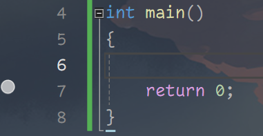
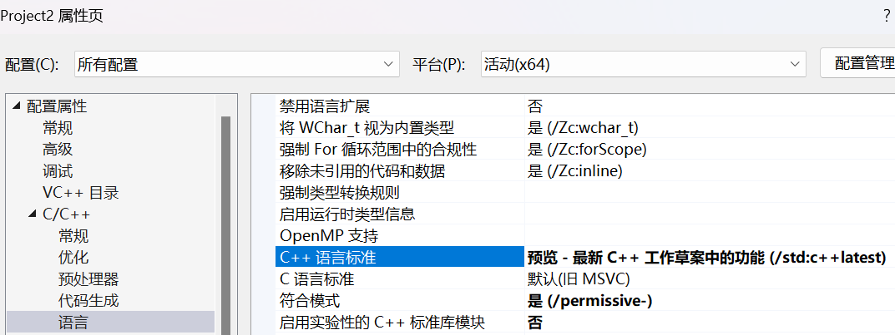
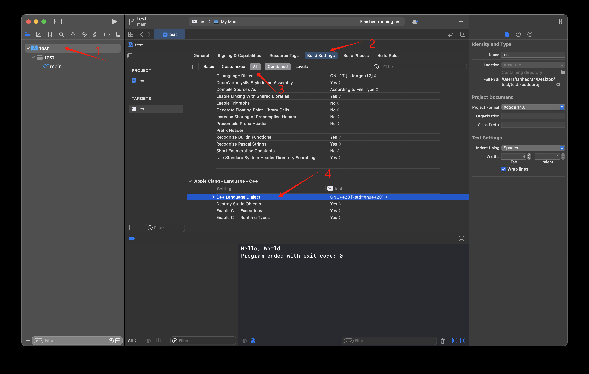

# C/C++ 开发环境配置

我们假设大家都上过《计算概论 A》或《计算概论 B》(C/C++ 描述)，你仍然可以沿用你的编程环境习惯。只需要能够支持 C++20 的标准即可。

但是，我们的 C++ 语言教学可能涉及到一些新语法，如果你在使用如 Dev-C++5.11、Visual C++ 6.0 等落后的 IDE，我们强烈推荐你更换你的编程环境以适合本课程的学习。

## 总览

程序员的开发环境一般分为以下部分：

- **所在操作系统**：就是你的电脑当前是什么操作系统，例如 Windows11，Ubuntu23.04（Linux 的一种发行版）等。

- **目标操作系统**：就是开发的程序将要在什么操作系统上运行，最简单的就是在什么操作系统上生成，就在什么操作系统上执行，在计算概论中大家就是这样的，本课程不会涉及到跨操作系统和跨平台架构的开发和编译。

- **编译器**：能够将源代码在所在操作系统编译为目标操作系统上的可执行程序的软件。

  > 同时，为了更方便地指定哪些代码以哪些选项生成哪些可执行程序，在较大型的工程中，程序员会使用“构建工具”（Build tools）来辅助这一过程；CMake、XMake 等就是这一工具。

- **编辑器**：能够方便地把各种代码文件组织起来，提供一定的编辑功能，并允许通过**插件**进行扩展的软件。

- **各种相关开发工具**，包括性能探测器、调试器（debugger）、格式化工具（formatter）等等。

一个 IDE（Integrated development environment，集成开发环境）集合了除目标操作系统外的所有软件，并允许插件扩展，适合大型工程的开发和新手的入门。除此之外，我们也可以逐个组装，获得自己想要的环境。

## 主流编译器介绍

- MSVC（Microsoft Visual C++）是微软提供的 C 和 C++ 编译器，作为 Visual Studio 集成开发环境的一部分。
  
  MSVC 专为 Windows 平台设计，提供了丰富的库和工具，以及与 Windows 操作系统和其他微软技术的紧密集成。
  
- GCC（GNU Compiler Collection）是一个免费、开源的编译器，支持多种编程语言，如 C、C++、Objective-C、Fortran、Ada 等。GCC 也支持多种平台，包括 Linux、macOS 和 Windows（通过 MinGW）。

  GCC 是 GNU 项目的核心组件，广泛应用于 Unix 和类 Unix 平台（如 Linux）。

  我们将会使用到 GCC 工具链中的 g++ 命令来编译 c++ 文件（相应的，gcc 命令用于编译 c 文件）。

- Clang 是一个基于 LLVM 的轻量级、高性能的 C、C++ 和 Objective-C 编译器。Clang 支持多种平台，包括 Linux、macOS 和 Windows。Clang 的目标是提供更快的编译时间、更好的诊断信息（错误和警告消息）以及与 GCC 和 MSVC 的兼容性。

  我们将会使用 clang++ 命令来编译 c++ 文件。

## 开发环境介绍

### 跨平台开发环境

跨平台开发环境，即适配了多个操作系统的开发环境，比如可以同时支持 Windows 平台和 MacOS 平台。

- **CLion**：这是一款由 JetBrains 公司开发的专门用于 C 和 C++ 开发的跨平台 IDE。
  主要通过 clangd 和 clang-format 等工具提供代码补全、格式化、调试等功能，并支持多种编译器（在 Windows 平台上内置了 MinGW 编译环境和 gdb 调试工具）。
  CLion 是一款收费软件，但提供了教育免费版，所以可以使用学校邮箱认证后免费使用正版的 CLion。

- **VSCode**：这是一个由 Microsoft 公司开发的功能强大的编辑器，自身不提供编译环境和各种开发工具，但可以通过插件等方式，调用其他的编译环境和开发环境。

  将 VSCode 与 GCC、MSVC 等编译器配合，即可打造强大的开发环境。

  > 还有很多其他的编辑器，例如 Sublime 等，这里就不介绍了。

### Windows 平台开发环境

- **Visual Studio**：这是一款由 Microsoft 公司开发的 IDE，简称**VS**，其 C/C++ 功能只在 Windows 平台上提供。Visual Studio for Mac 已经停止维护，**请不要在非 Windows 平台使用 Visual Studio**。
  
  Visual Studio 提供了名为**msvc**的编译器，并集成了编辑器环境和各种相关的功能强大的开发工具；VS 的目标操作系统为 Windows，但是通过虚拟环境或者服务器，也支持 Linux 目标操作系统。

### MacOS 平台开发环境

- **XCode**：XCode 是 Apple 公司开发的专门用于 Apple 旗下各种操作系统下的软件开发的 IDE。
  也可以用来进行 C/C++ 开发，提供了 C/C++ 的编译器以及各种开发工具。

### 如何选择开发环境？

按照我们的说法，你可以根据你的需要进行任意组合，例如：

- 「Windows」仅使用 Visual Studio（开箱即用，功能强大，但较笨重）。
- 「MacOS」仅使用 XCode。
- 「跨平台」使用 CLion，并使用 CLion 的内置编译环境（开箱即用，功能强大，教育免费）。
- 「Windows」使用 VSCode，并安装 VS，从而可以在 VSCode 上使用 msvc（轻量，快速，提供够用的功能）。
- 「跨平台」使用 VSCode+GCC/Clang（轻量，快速）。

## MSVC: Visual Studio

请在[Visual Studio 官网](https://visualstudio.microsoft.com/)下载 VS 社区版，并在安装时勾选“使用 C++ 的桌面开发”。如果你已经下载了，可以随时在 Visual Studio Installer 中进行更新（在下面任务栏中搜索即可）。

> 如果 VS 的更新非常慢，与正常网速严重不匹配，可以在[download.visualstudio.microsoft.com - dns 查询--站长工具 (chinaz.com)](https://tool.chinaz.com/dns/download.visualstudio.microsoft.com)中找到 TTL 值最小的 IP 地址，并在`C:\Windows\System32\drivers\etc`中的`hosts`文件（请用管理员模式打开）的最后一行加上`在网站中找到的地址 download.visualstudio.microsoft.com`即可。

Visual Studio 是一款强大的 IDE，具有复杂工程开发中必备的各种工具，也比较适合新手入门使用。下载 VS 后，会自动下载微软的 C++ 编译器 msvc。Windows 上的开发一般适合使用 msvc 的工具链。

### 一般工程

点击“创建新项目”，找到“空项目”，点击创建即可：


进入工程后（VS 称之为“解决方案”，solution），在右侧边栏的“解决方案资源管理器”中找到“源文件”，右键点击，并点击“新建项”（你也可以直接使用快捷键 Ctrl+Shift+A），选择“C++ 文件”，并在下方修改名称即可。


随后，你就可以编写 C++ 代码了；编写完成后，可以按 Ctrl+F5 进行编译并运行，也可以按 Ctrl+B 只编译不运行；如果想进行 Debug，就在相应的代码行的左侧点击加上断点，并按 F5 进行 debug。



特别地，VS 默认有两个模式，即 Debug 和 Release 模式，它们对应了不同的编译器选项，Debug 模式允许你进行 debug，release 模式则开启了大量的优化选项，代码通常不直接按照你写的顺序执行，无法进行 debug。

你可以在顶部的`项目`中找到`属性`，并设置工程选项；我们的课程要求使用 C++20，所以请在其中的`C/C++ -> 语言`中的`C++语言标准`至少启用 C++20。注意，你可以在配置和平台处选择“所有配置”来为 Debug 和 Release 启用相同的选项。



### CMake 工程

类似地，可以在创建新项目时选择"CMake 项目"，随后在相应的文件夹下创建文件等即可，并编写 CMakeLists.txt；每次保存 CMakeLists.txt 后，如果格式正确，VS 会自动根据 target 把代码文件包括进解决方案资源。

如果你已经有一个并非 VS 创建的 CMake 工程（例如从 github 中下载下来的），可以不点击“创建新项目”，而是点击“打开本地文件夹”，VS 也会自动识别 CMakeLists.txt 来生成相应的解决方案。

> CMake 本身也可以在 Windows 平台上生成解决方案，供 VS 打开使用。

### 命令行

在下载 Visual Studio 后，你也可以在命令行中使用 msvc 编译器。在任务栏中搜索“x64 Native Tools Command Prompt for VS”（一般输入 x64 Native 就够了），即可打开已经为 msvc 初始化好的命令行（普通的命令行不能直接用 msvc 编译器）。随后输入`cl /EHsc 代码文件 /Fe可执行文件保存路径`即可，例如`cl /EHsc a.cpp /Fetest`，即会生成`test.exe`。

> VS 中直接按 Ctrl+`（即电脑左上角的按键，和波浪线同一按钮）也可以使用命令行。

你可以看[微软的官方文档](https://learn.microsoft.com/en-us/cpp/build/reference/compiler-options-listed-by-category)或通过`cl -help`来了解更多的编译器选项，**不过一般情况下不建议直接在命令行使用 msvc 编译器**。

## GCC

### Windows: MinGW (MSYS2)

MinGW，全称 Minimal GNU for Windows，用于在 Windows 上使用 gcc 工具链。虽然一般情况下推荐使用微软自己的工具链，但是它确实存在一些问题：

- 如果你写的一些代码不符合 C++ 标准，例如出现了仅 gcc 编译器支持的“方言”，那么在 Windows 上使用 msvc 编译器和在 Linux 上使用 g++ 编译器可能导致不同的行为（甚至换用编译器可能编译不过）；
- 如果你的工作要求使用全开源工具链（<del>或者你痛恨微软作恶太多，包括对 msvc 编译器不开源</del>），MinGW 和 gcc 都是开源的；
- ...

目前 MinGW 本体已经停止维护，所以一般使用在它之上的分支 MinGW-w64。开发者一般下载集成 MinGW-w64 的工具链，我们比较建议大家使用 MSYS2；请参考[MSYS2 官网](https://www.msys2.org/)进行安装。特别地，如果由于网络原因无法下载 installer，可以使用以下镜像（请下载其中的那个纯`.exe`文件）：

- 清华镜像：[https://mirrors.tuna.tsinghua.edu.cn/msys2/distrib/x86_64](https://mirrors.tuna.tsinghua.edu.cn/msys2/distrib/x86_64)
- 科大镜像：[https://mirrors.ustc.edu.cn/msys2/distrib](https://mirrors.ustc.edu.cn/msys2/distrib/)
- github 镜像：[https://hub.nuaa.cf/msys2/msys2-installer/releases](https://hub.nuaa.cf/msys2/msys2-installer/releases)

如果你完全遵照官网的教程进行了安装，那么你应该已经安装了`mingw-w64-ucrt-x86_64-gcc`软件包。

如果你没有在安装过程中修改 MSYS2 的安装位置，那么 gcc 编译器应该被安装到了`C:\msys64\ucrt64\bin\gcc.exe`，g++ 应该被安装到了`C:\msys64\ucrt64\bin\g++.exe`。如果你修改了安装位置，那么请将`C:\msys64`替换为你修改后的位置。

请记住这个位置，在之后的 vscode 的配置过程中，你可能会用到这个路径。

## MacOS: homebrew

如果你已经使用`xcode-select`安装过开发工具包，那么你可能会发现你可以在命令行中运行`gcc`命令。但是，这并是不是真正的 gcc，这只是 Apple 给它的 Apple Clang 编译器加的一个别名。想要使用真正的 GCC 工具链，你可以通过[homebrew](https://brew.sh/)来安装。

安装 homebrew，只需要在终端中运行以下命令：

```bash
/bin/bash -c "$(curl -fsSL https://raw.githubusercontent.com/Homebrew/install/HEAD/install.sh)"
```

安装完 homebrew 之后，使用以下命令来安装最新版本的 GCC 编译器：

```bash
brew install gcc
```

截止 2024 年 2 月，gcc 的最新版本为 13，所以你可以通过`gcc-13`来调用 gcc 编译器。

你也可以将`gcc`修改成`gcc-13`的别名，以方便使用：

- 如果你的 Mac 电脑是使用 M 系列的 arm 芯片（较新的 Mac 电脑），然后重启终端即可

```bash
cd /opt/homebrew/bin
ln -s g++-13 g++
ln -s gcc-13 gcc
```

- 如果你的 Mac 电脑是使用较老的 Intel 芯片，然后重启终端即可

```bash
cd /usr/local/bin
ln -s g++-13 g++
ln -s gcc-13 gcc
```

## Clang（跨平台）

### Windows

#### 通过 VS 安装

Visual Studio 允许以组件形式集成 LLVM Clang，在安装时（或者从 Visual Studio Installer 选择“修改”）点击“单个组件”，搜索`clang`：


勾选并安装即可。随后就可以在`VS安装位置\VC\Tools\Llvm\x64\bin`中找到 clang 编译器。

#### 直接安装

你可以在[Release LLVM 17.0.6 · llvm/llvm-project (github.com)](https://github.com/llvm/llvm-project/releases/tag/llvmorg-17.0.6)（如果无法访问 github，可以使用前面 hub nuaa cf 的镜像）找到`...win64.exe`并进行安装。在`安装路径\bin`中就可以找到相应的编译器。

如果你想在命令行中使用，可以`路径\clang++ 源文件 -std=c++20 -o 可执行文件.exe`，与 gcc 十分类似。不过我们还是建议你使用 VSCode 等编辑器来配合 Clang 编译器。你可能需要在环境变量中加入该路径（在任务栏搜索“编辑系统环境变量”，点击下方“环境变量”，在用户变量或系统变量的`Path`变量处添加上该路径即可），以使得 CMake 等构建工具更方便地查找到 LLVM 的工具链。

### MacOS: xcode-select

Apple 官方提供了一个名为`xcode-select`的工具来安装 clang 编译器等开发工具，你只需要在你的 mac 电脑中打开终端，运行以下命令，然后根据提示就可以安装。

```
xcode-select --install
```

但值得注意的是，这种方法安装的是**Apple Clang**，是 Apple 公司从原版 Clang 修改而成，其特性与原版 Clang 有一些区别。对于 C++ 标准的支持，Apple Clang 不如原版的 Clang。

## VSCode

注意：在开始配置 VSCode 之前，你需要先参照前面的章节，先安装 MSVC、GCC、Clang 之中的任意一个编译器。

这是一款纯编辑器，首先在[VS Code 官网](https://code.visualstudio.com/)下载 VS Code，并需要安装下面的插件之一来提供一定的开发工具（代码提示等）：

1. Microsoft C/C++ Extension (cpptools):

   

2. clangd + codelldb：

   clangd 是 LLVM 项目团队开发的跨编辑器的提供 C/C++ 的代码提示、实时代码分析等功能的软件，其运行速度**远快于**由 Microsoft 开发的 C/C++ Extension(下称 cpptools)。但 clangd 不提供调试功能，所以调试功能需要使用其他插件实现。

   可以使用 cpptools 并关闭其智能提示功能来让其单纯作为调试工具；也可以使用 codelldb 插件。lldb 是 LLVM 项目中的调试器，与 gdb 的特性有区别。在 vscode 中，codelldb 提供的特性比 cpptools 更加方便，因此推荐使用 codelldb。
   
直接在 vscode 商店中下载这两个插件即可使用。安装好之后插件会自动下载所需要的二进制包，期间可能会遇到网络问题，可以通过使用网络代理等方式解决。
   

   


同时：我们比较建议使用 CMake 或者 XMake 这种构建工具来组织代码，进行各种配置比较方便。如果你想使用无构建工具辅助的组织形式，我们也在最后给了一个例子。

用 VSCode 打开一个文件夹后，会出现如下的提示：


我们自己创建的文件夹都是安全的，所以选择"Yes"即可；如果你从互联网上下载，并且它很有可能对你的环境进行恶意的攻击，那么可以选择"No"。这门课就全选 Yes 就行了（

### CMake

我们建议安装 CMake 和 CMake Tools 两个插件，并同时安装 CMake 本身。如果你已经安装了 Visual Studio，它在`VS路径\Common7\IDE\CommonExtensions\Microsoft\CMake\CMake\bin`中就已经安装了 CMake 软件（不过微软可能进行了一些改造）；除此之外，你也可以自己在[CMake 官网](https://cmake.org/download/)安装标准的 CMake，在你的安装路径就可以找到。

随后，你有两种选择：

- 在环境变量中加入该路径（在任务栏搜索“编辑系统环境变量”，点击下方“环境变量”，在用户变量或系统变量的`Path`变量处添加上 CMake 路径即可）。这样，你在命令行中也可以直接使用 CMake。

  > 请关闭 VSCode，随后重新打开以使新的环境变量在 VSCode 中生效。

- 或者：你可以改变 cmake-tools 插件中的设置（插件右下角的齿轮），把 CMake path（搜索 path 就能找到）改为该路径。

然后在文件夹中创建`CMakeLists.txt`，如下：

```cmake
cmake_minimum_required(VERSION 3.10) # 该项目所需的cmake最小版本
project(demo) # 项目名称

set(CMAKE_CXX_STANDARD 20) # 设置C++版本，至少是20。
add_executable(a a.cpp) # a是可执行文件的名字，a.cpp是用于构建的代码文件
```

此外，应当把 cmake-tools 插件中的设置中的“status bar visibility"改为"compact"，这时下方的状态栏就会出现 CMake 相关的图标，点击"Kit"的选项选择工具链；如果你已经安装了 Visual Studio，选择`-amd64`那个即可使用`msvc`；如果你想使用 MinGW，请选择 MinGW 的那个选项。

> - 在以前的版本中，使用 VS 的 toolkit 可能需要使用管理员模式启动 VSCode 来成功构建；助教在最新版的 VSCode 和 VS2022 中未发现此问题。
> - MinGW 可能不支持非 ascii 码路径（即不支持中文路径）。

随后就可以点击齿轮进行编译，点击`▶`符号进行运行，虫子的符号进行 debug。你可以把`Debug`换为`Release`得到优化版本。如果你需要更多的可执行程序，就再加其他的`add_executable`即可。

### XMake

XMake 是由中国工程师开发的开源构建工具，使用 lua 语言编写脚本（相比于 CMakeLists 可读性更高些），并集成了包管理工具 xrepo，解决了很多 CMake 本身的痛点问题。不过它目前的普适程度和功能完善程度还比不上 CMake（虽然可以自动生成 CMakeLists），所以仅供有兴趣的同学使用。

如果你想使用 XMake，你可以安装插件 XMake，并安装 XMake 本身（详见[安装 - xmake](https://xmake.io/#/zh-cn/guide/installation)）。在 Windows 中用 Installer 安装时**注意勾选”添加到环境变量 PATH“中**。

随后编写`xmake.lua`：

```lua
set_xmakever("2.8.6") -- xmake最小版本
set_project("demo") -- 项目名称

set_languages("cxx20") -- 设置C++版本，至少是20
target("a") -- 可执行文件的名字
    add_files("a.cpp") -- 用于构建的代码文件
```

然后保存，就会在`.vscode`下自动生成`compile_commands.json`文件。这个文件生成与否不会影响构建，只会影响代码补全等功能。在下面任务栏就可以选择构建选项，`release`可以换为`debug`，`toolchain`可以换为其他需要的工具链（例如，Windows 在装了 VS 的情况下默认为 msvc，可以换为 mingw），其余符号与 CMake 插件一致。

随后，为了能让代码补全正确发挥作用，你需要调整一些插件的设置。

- 如果你使用的是 Microsoft C/C++，使用`ctrl-shift-p`（Mac 下为`command-shift-p`）打开 vscode 命令面板，搜索`c/c++`，进入`C/C++：编辑配置（UI）`。

  

  然后调整其中的**C++ 标准**到**c++20**，和高级设置中的**配置命令**到`.vscode/compile_commands.json`。

  

  

- 如果你使用的是 clangd 插件，那么你需要在 vscode 的设置中搜索 clangd，并在 Arguments 选项中添加`--compile-commands-dir=.vscode`。

  

之后，就可以正常进行代码提示了。每次保存`xmake.lua`都会自动重新生成`compile_commands.json`，代码的某些提示也可以相应改变。

> 第一次在空文件夹下创建`xmake.lua`时，如果没有自动生成`compile_commands.json`，可以重启 VSCode 再保存。
>
> 若重新保存未重新生成，可以清空`compile_commands.json`后重试。如果仍未成功，可以添加`add_rules("plugin.compile_commands.autoupdate", {outputdir = ".vscode"})`，再重新构建程序。
>
> 对于 msvc，如果 cpptools 还提示有系统头文件找不到的问题，可以把标准库路径也加入到`compile_commands.json`的`includePath`中，即`VS安装位置\\VC\\Tools\\MSVC\\**`。

### 无构建工具（Microsoft C/C++ 插件）

你可以随意创造一个文件，随便写点代码，发现点右上角的`▶`符号并不能进行编译。
此时你需要在项目根目录创建`.vscode`子文件夹，并加入 tasks.json 和 launch.json。

- 「Windows」如果使用 MSVC 编译器（不推荐），则在.vscode 文件夹中新建 tasks.json 中填写以下内容：

  > 这本质上就是在指定命令行参数，因此你需要在 x64 native terminal（参见前文 Visual Studio 安装流程）中`cd 工作目录`，再用`code .`来用 VSCode 打开文件夹，来使 msvc 正常工作。
  >
  > 每次使用 vscode 都需要这样打开，过于麻烦，所以不推荐 vscode 在无构建工具使用 msvc。

  ```json
  {
    "version": "2.0.0",
    "tasks": [
      {
        "label": "create build dir",
        "type": "shell",
        "command": "cmd",
        "args": ["/C", "if not exist .\\build mkdir .\\build"]
      },
      {
        "type": "shell",
        "label": "C/C++: cl.exe build active file",
        "command": "cl.exe",
        "args": [
          "/std:c++20",
          "/Zi",
          "/EHsc",
          "/Fe:",
          "${fileDirname}\\build\\${fileBasenameNoExtension}.exe",
          "/Fo:",
          "${fileDirname}\\build\\${fileBasenameNoExtension}.obj",
          "/Fd:",
          "${fileDirname}\\build\\${fileBasenameNoExtension}.pdb",
          "${file}"
        ],
        "problemMatcher": ["$msCompile"],
        "group": {
          "kind": "build",
          "isDefault": true
        },
        "dependsOn": ["create build dir"]
      }
    ]
  }
  ```

  然后在.vscode 文件夹中创建 launch.json 文件并加入以下内容（你可以把`//`表示的注释去掉）：

  ```json
    {
      "version": "0.2.0",
      "configurations": [
        {
          "name": "C/C++: cl.exe generate and debug active file",
          // type 告诉 vscode 编译器任务的类型
          // 这个是规定的，不是随便写，比如 msvc 编译器就是 cppvsdbg
          "type": "cppvsdbg",
          "request": "launch", //有 launch 和 attach 可选，这里填 launch，按下 F5 就可以启动调试了；而不是 attach（附加）
          // program 这个是你的可执行程序位置，这里可以根据自己的 tasks.json 生成
          // 程序的位置自定义修改，等会参照后面的 tasks.json 内容
          //程序所在路径和程序名
          "program": "${fileDirname}\\build\\${fileBasenameNoExtension}.exe",
          //这里填命令行参数（main 函数的形参）
          "args": [],
          //为 true 时，在开始运行程序时，不立刻往后执行，先暂停一下，一般填 false；
          "stopAtEntry": false,
          //目标工作目录，在哪个目录调试程序，一般在当前文件夹（项目所在文件夹）；
          "cwd": "${fileDirname}",
          //临时手动添加环境变量；
          "environment": [],
          //使用内置终端运行程序，支持输入
          "console": "integratedTerminal",
          //这个表示 执行调试前 要完成的任务 该值需要与 tasks.json 中的 label 相同，否则调试时会提示找不到；
          "preLaunchTask": "C/C++: cl.exe build active file"
        }
      ]
    }
  ```

- 「跨平台」如果你使用 GCC/Clang，可以在.vscode 文件夹中添加 tasks.json 文件并添加以下内容，然后根据需要修改其中的 command 路径：

  ```json
  {
    "version": "2.0.0",
    "tasks": [
      {
        "label": "create build dir",
        "type": "shell",
        "command": "mkdir -p ./build",
        "windows": {
          "command": "cmd",
          "args": ["/C", "if not exist .\\build mkdir .\\build"]
        }
      },
      {
        "type": "shell",
        "label": "C/C++: c++ build active file",
        // 你的g++或clang++路径
        // 如果你使用的是由MSYS2安装的GCC，那么路径可能是C:\msys64\ucrt64\bin\g++.exe
        "command": "g++",
        "args": [
          "-fdiagnostics-color=always",
          "-Wall",
          "-std=c++20",
          "-o",
          "${fileDirname}/build/${fileBasenameNoExtension}",
          "${file}"
        ],
        "problemMatcher": ["$gcc"],
        "group": {
          "kind": "build",
          "isDefault": true
        },
        "dependsOn": ["create build dir"]
      }
    ]
  }
  ```

  然后在.vscode 文件夹中创建 launch.json 并添加以下内容：

  ```json
  {
    "version": "0.2.0",
    "configurations": [
      {
        "name": "C/C++: c++ generate and debug active file",
        // type 告诉 vscode 编译器任务的类型，这里是 cppdgb，不能随意修改
        "type": "cppdbg",
        "request": "launch", //有 launch 和 attach 可选，这里填 launch，按下 F5 就可以启动调试了；而不是 attach（附加）
        // program 这个是你的可执行程序位置，这里可以根据自己的 tasks.json 生成
        // 程序的位置自定义修改
        "program": "${fileDirname}/build/${fileBasenameNoExtension}",
        "windows": {
          "program": "${fileDirname}/build/${fileBasenameNoExtension}.exe"
        },
        //这里填命令行参数（main 函数的形参）
        "args": [],
        //为 true 时，在开始运行程序时，不立刻往后执行，先暂停一下，一般填 false；
        "stopAtEntry": false,
        //目标工作目录，在哪个目录调试程序，一般在当前文件夹（项目所在文件夹）；
        "cwd": "${fileDirname}",
        //是否在外部控制台运行程序。如果为 false，则使用 vscode 的控制台运行程序。
        "externalConsole": false,
        //这个表示 执行调试前 要完成的任务 该值需要与 tasks.json 中的 label 相同，否则调试时会提示找不到；
        "preLaunchTask": "C/C++: c++ build active file"
      }
    ]
  }
  ```

最后，需要配置 Microsoft C/C++ Extension 使其支持 c++20：
使用`ctrl-shift-p`（Mac 下为`command-shift-p`）打开 vscode 命令面板，搜索`c/c++`，进入`C/C++：编辑配置（UI）`。


然后调整其中的**C++ 标准**到**c++20**。


### 无构建工具（clangd+codelldb）

由于 codelldb 并不支持调试由 mvsc 构建的二进制文件，所以以下仅包含使用 gcc/clang 的示例。

新建.vscode/tasks.json 文件并加入以下内容（对 GCC 和 Clang 通用）：

```json
{
  "version": "2.0.0",
  "tasks": [
    {
      "label": "create build dir",
      "type": "shell",
      "command": "mkdir -p ./build",
      "windows": {
        "command": "cmd",
        "args": ["/C", "if not exist .\\build mkdir .\\build"]
      }
    },
    {
      "label": "g++ build",
      "type": "shell",
      "dependsOn": ["create build dir"],
      "command": "g++", // 如果需要使用 Clang，这将这里的 g++ 改为 clang++。
      "args": [
        // 下面一行指定编译器的优化级别，可以根据需要修改。一般来说 O0 适合用于调试。
        "-O0",
        "-g",
        "-std=c++20",
        "${file}",
        "-o",
        "${fileDirname}/build/${fileBasenameNoExtension}"
      ],
      // 如果你使用的是 windows 且想要修改编译参数，请修改下面的内容并忽略上面的 args
      "windows": {
          "args": [
            // 下面一行指定编译器的优化级别，可以根据需要修改。一般来说 O0 适合用于调试。
            "-O0",
            "-g",
            "-std=c++20",
            "${file}",
            "-o",
            "${fileDirname}/build/${fileBasenameNoExtension}.exe"
          ],
      }
      "problemMatcher": {
        "owner": "cpp",
        "fileLocation": ["relative", "${workspaceFolder}"],
        "pattern": {
          "regexp": "^(.*):(\\d+):(\\d+):\\s+(warning|error):\\s+(.*)$",
          "file": 1,
          "line": 2,
          "column": 3,
          "severity": 4,
          "message": 5
        }
      }
    }
  ]
}
```

在.vscode/launch.json 中添加：

```json
{
  "version": "0.2.0",
  "configurations": [
    {
      "type": "lldb",
      "request": "launch",
      "name": "Debug",
      "program": "${fileDirname}/build/${fileBasenameNoExtension}",
      "windows": {
        "program": "${fileDirname}/build/${fileBasenameNoExtension}.exe",
      }
      "args": [],
      "cwd": "${workspaceFolder}",
      "preLaunchTask": "g++ build"
    }
  ]
}
```

之后使用 F5 即可编译并调试文件。

## CLion（跨平台）

### 申请教育免费账号

在[JetBrains 官网](https://www.jetbrains.com/community/education/#students_)可以申请教育免费许可证。
在网页上，选择**For students and teachers**计划即可。然后通过你的学校邮箱申请教育免费许可证。
所有信息如实填写即可。申请后你的邮箱会收到一条验证用的邮件，通过邮件中的链接认证后即可申请成功。

注意：JetBrains 教育免费许可证一次申请只有一年的有效期，过期需要重新申请，但只要保证学生身份，重新申请仍然是免费的。


### 安装 CLion

你可以通过[JetBrains 官网](https://www.jetbrains.com/clion/)下载 CLion。下载完 CLion 后根据提示安装即可。

安装完之后启动 CLion，根据提示通过软件使用条款等，直到进入以下页面，并选择**Activate CLion**。


在下一个界面，选择**Log In to JetBrains Account**，会自动打开浏览器网页进行登录，登录之前申请好教育免费许可证的账户即可。

之后就可以开始使用 CLion 了。并且 CLion 自带了较新版本的 mingw、gcd、cmake 等环境，所以不需要额外安装其他软件即可开始编程。

### 基本使用

进入 CLion，如果没有打开项目，你将会看到 CLion 的开始屏幕，选择**New Project**即可创建项目。

在下一个页面，在左侧栏选择**C++ Exectuable**，然后指定项目存放路径**Location**和 C++ 语言标准**Language standard**。
项目路径建议不要包含中文字符，以免引起不必要的麻烦。
C++ 语言标准选择**c++20**即可。

第一次创建项目之后 CLion 会让你配置编译环境，由于我们直接使用 CLion 自带的 mingw 环境，所以保持配置不变直接确认即可。


成功创建项目之后，就可以看到 CLion 的编辑界面，然后愉快地开始编程了。
界面右上角有三个图标：锤子图标代表构建项目，播放图标代表运行项目，虫子图标代表调试项目。

CLion 使用 CMake 来管理项目，所以你可以在 CMakeLists.txt 中修改相应配置来管理项目。


## XCode (MacOS)

### 安装

直接在 App Store 中搜索 XCode 并安装即可。

第一次打开 XCode，会弹出选择安装开发套件的窗口，我们保持默认的选择（macOS）即可。


### 创建 C++ 项目

打开 XCode 之后，会弹出 XCode 的主页，选择**Create New Project**即可开始创建工程。


在下一个页面，在**MacOS**分类中选择**Command Line Tool**然后确定。


在下一个页面中，依次填写**Product Name**、**Organization Identifier**，**在 Language 栏选择 C++**，确认之后选择一个保存的路径即可。


### 基本使用

创建好项目后会自动打开，点击右上角的按钮或者使用快捷键`command-R`即可编译并运行程序。
在页面下方，点击打开输出窗口的按钮（图中箭头指示处）即可看到程序的输出。


我们的课程要求的是 C++20 标准，XCode 默认创建的项目已经设置为了该标准，你也可以通过下图中步骤修改。


