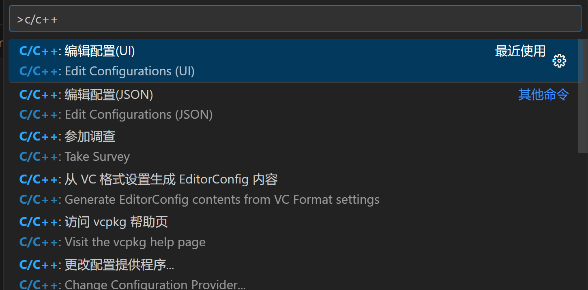
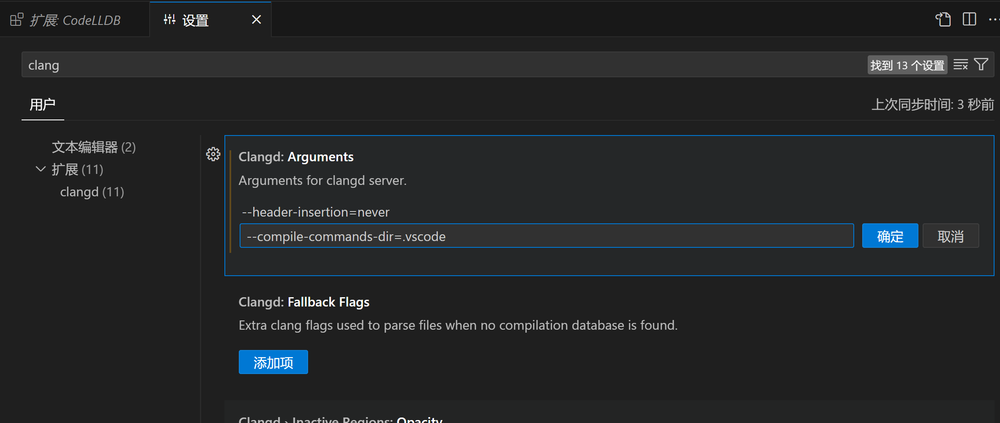

# XMake

XMake是由中国工程师开发的开源构建工具，解决了很多CMake本身的痛点问题，包括：

+ 使用lua语言编写脚本，相比于CMakeLists可读性更高些；
+ 集成了包管理工具xrepo，有python中pip一样的丝滑体验；
+ 对新特性有较快速的支持，例如C++20开始模块相关的部分；
+ ...

不过它目前的普适程度和功能完善程度还比不上CMake（虽然可以自动生成CMakeLists），例如在各个编辑器或IDE中的使用还不太方便；我们的课程也不涉及复杂包的安装和支持不完善的语言特性，所以仅供有兴趣的同学使用。

如果你想使用XMake，你可以在安装插件XMake，并安装XMake本身（详见[安装 - xmake](https://xmake.io/#/zh-cn/guide/installation)）。在Windows中用Installer安装时**注意勾选”添加到环境变量PATH“中**。

随后编写`xmake.lua`：

```lua
set_xmakever("2.8.6") -- xmake最小版本
set_project("demo") -- 项目名称

set_languages("cxx20") -- 设置C++版本，至少是20
target("a") -- 可执行文件的名字
    add_files("a.cpp") -- 用于构建的代码文件
```

使用`xmake`即可构建程序；如果你有多个目标，那么`xmake -b a`来指定生成某个目标。关于xmake的更多方法我们不再详述，请参见[xmake文档](https://xmake.io)或者相关知乎文章。我们下面只是简单地说一下xmake如何配合其他设施使用（当然你直接用`xmake project -k cmakelists`来生成CMakeLists.txt并用CMake工程也可以）。

## Visual Studio

`xmake project -k vsxmake -m "debug,release"`即可生成包含Debug和Release模式的工程文件（`.sln`），用Visual Studio打开即可。如果需要每次更新xmake后自动更新项目，可以加一个`add_rules("plugin.vsxmake.autoupdate")`。

## CLion

下载XMake插件，打开相应的文件夹即可。不过该插件还有很多兼容性的问题，你可以生成CMakeLists来进行开发。

## VSCode

首先下载XMake的插件；在编写`xmake.lua`并保存后，`compile_commands.json`就会在`.vscode`下自动生成。这个文件生成与否不会影响构建，只会影响代码补全等功能。在下面任务栏就可以选择构建选项，`release`可以换为`debug`，`toolchain`可以换为其他需要的工具链（例如，Windows在装了VS的情况下默认为msvc，可以换为mingw），其余符号与CMake插件一致。

随后，为了能让代码补全正确发挥作用，你需要调整一些插件的设置。

- 如果你使用的是Microsoft C/C++，使用`ctrl-shift-p`（Mac下为`command-shift-p`）打开vscode命令面板，搜索`c/c++`，进入`C/C++：编辑配置（UI）`。

  

  然后调整其中的**C++标准**到**c++20**（即和xmake指定的版本一致的版本），和高级设置中的**配置命令**到`.vscode/compile_commands.json`。

  

  

- 如果你使用的是clangd插件，那么你需要在vscode的设置中搜索clangd，并在Arguments选项中添加`--compile-commands-dir=.vscode`。

  

之后，就可以正常进行代码提示了。每次保存`xmake.lua`都会自动重新生成`compile_commands.json`，代码的某些提示也可以相应改变。

> 第一次在空文件夹下创建`xmake.lua`时，如果没有自动生成`compile_commands.json`，可以重启VSCode再保存。
>
> 若重新保存未重新生成，可以清空`compile_commands.json`后重试。如果仍未成功，可以添加`add_rules("plugin.compile_commands.autoupdate", {outputdir = ".vscode"})`，再重新构建程序。
>
> 对于msvc，如果cpptools还提示有系统头文件找不到的问题，可以把标准库路径也加入到`compile_commands.json`的`includePath`中，即`VS安装位置\\VC\\Tools\\MSVC\\**`。